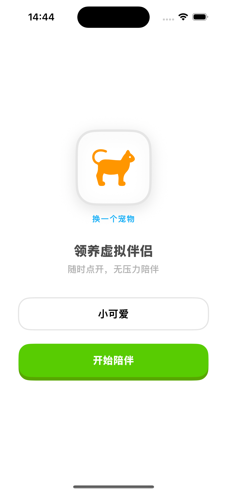
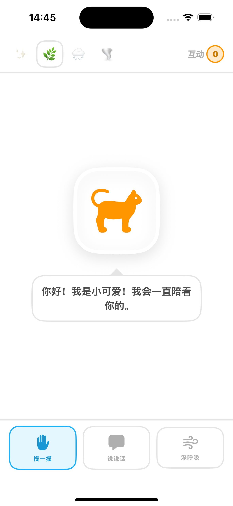
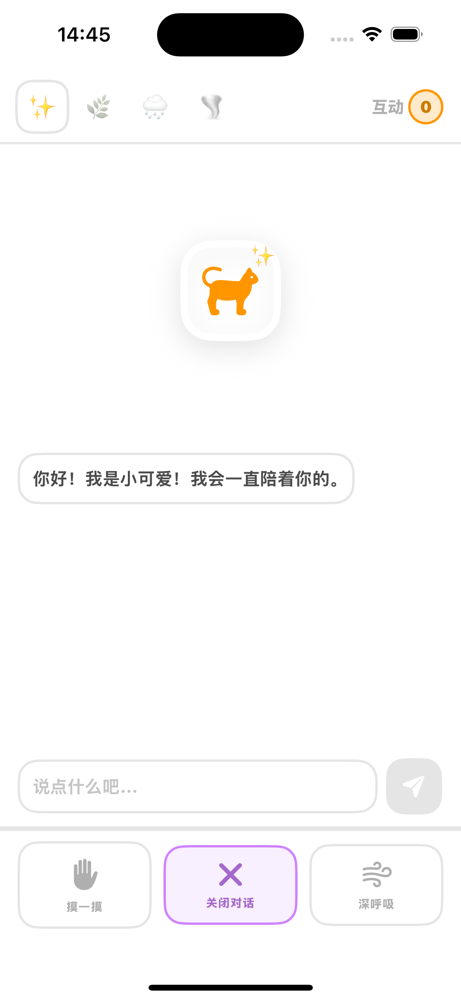
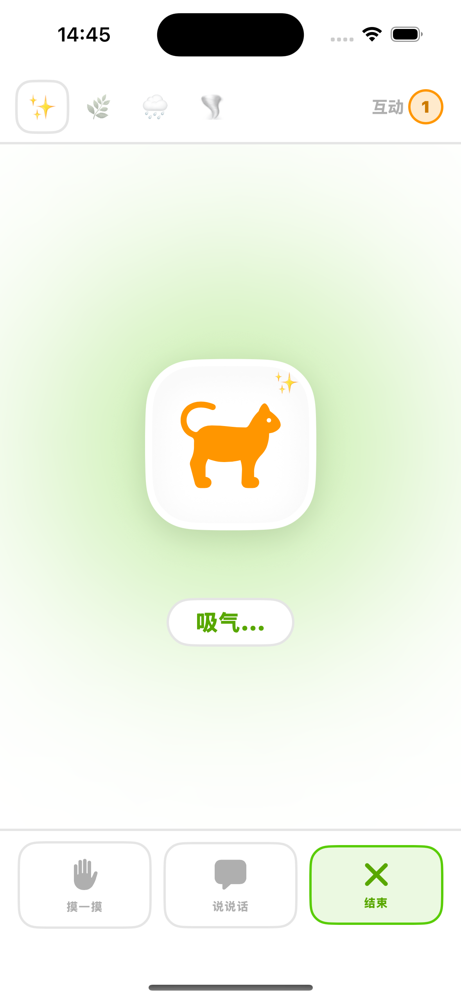
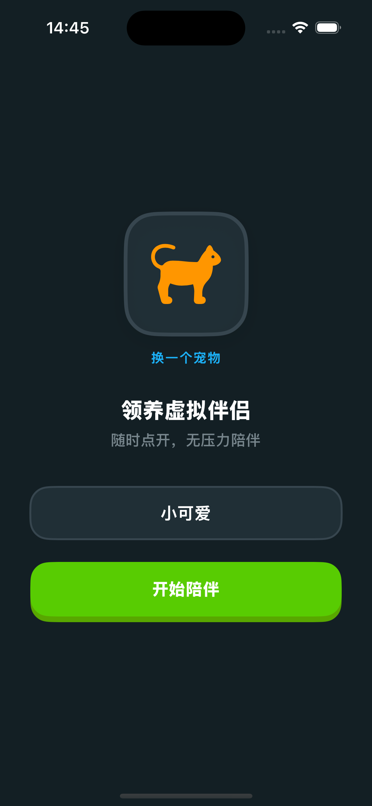
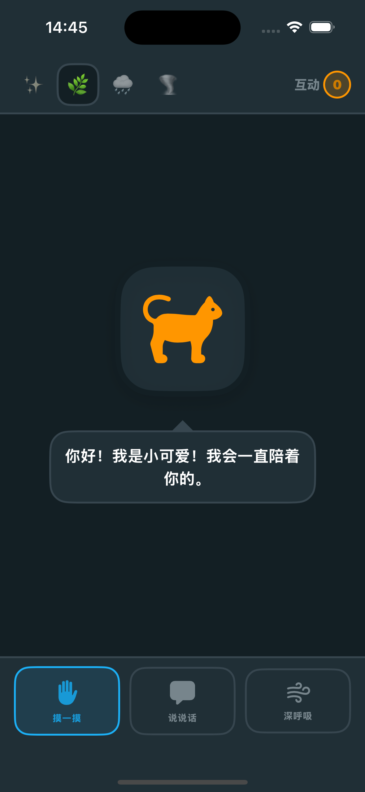
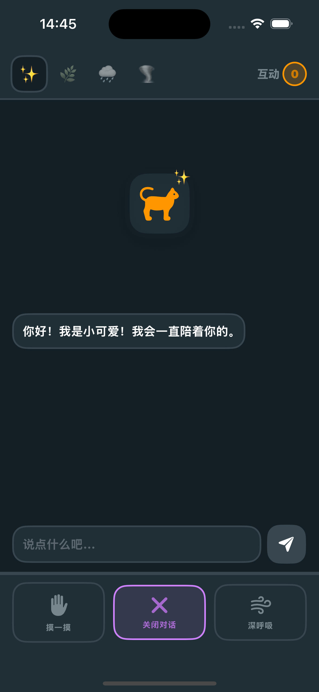
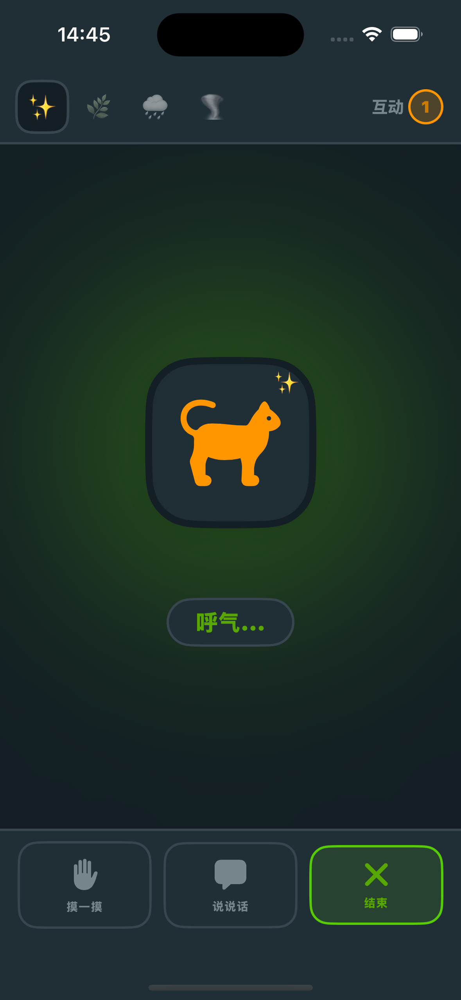

# Healing Pet App

## 项目简介

Healing Pet App 是一款治愈系宠物互动应用，旨在通过与虚拟宠物的互动、呼吸练习和对话功能，为用户提供情感支持和心理慰藉。

### 核心功能

- **宠物互动**：与可爱的虚拟宠物进行互动，提升情感连接
- **呼吸练习**：通过引导式呼吸练习帮助用户放松心情
- **智能对话**：与宠物进行简单的对话交流
- **心情记录**：记录和追踪用户的情绪状态
- **互动计数**：记录与宠物的互动次数，增强成就感

## 截图





## 技术栈

- **开发语言**：Swift
- **UI框架**：SwiftUI
- **状态管理**：ObservableObject
- **项目结构**：MVVM架构

## 项目结构

```
healing-pet-app/
├── Assets.xcassets/           # 资源文件
├── Models/                    # 数据模型
│   └── Models.swift
├── Stores/                    # 状态管理
│   └── PetStore.swift
├── Utils/                     # 工具类和主题
│   └── Theme.swift
├── Views/                     # 视图文件
│   ├── ContentView.swift
│   ├── OnboardingView.swift
│   └── PetMainView.swift
├── healing_pet_app.entitlements
└── healing_pet_appApp.swift   # 应用入口
```

## 安装说明

1. 克隆项目到本地
2. 使用 Xcode 打开 `healing-pet-app.xcodeproj` 文件
3. 选择目标设备或模拟器
4. 点击运行按钮启动应用

## 功能使用

### 主界面
- **顶部**：心情选择按钮和互动计数
- **中间**：宠物显示区域，根据当前模式展示不同内容
- **底部**：三个功能按钮（摸一摸、说说话、深呼吸）

### 模式切换
- **摸一摸**：与宠物互动，提升情感连接
- **说说话**：与宠物进行对话交流
- **深呼吸**：进行引导式呼吸练习

## 开发说明

### 新增功能
- 如需添加新功能，请在对应目录下创建新文件
- 遵循 Swift 编码规范和最佳实践
- 保持代码结构清晰，便于维护

### 测试
- 确保在不同设备和系统版本上测试应用
- 检查应用在不同屏幕尺寸下的显示效果

## 贡献

欢迎提交 Issue 和 Pull Request，帮助改进这个项目。

## 许可证

MIT License